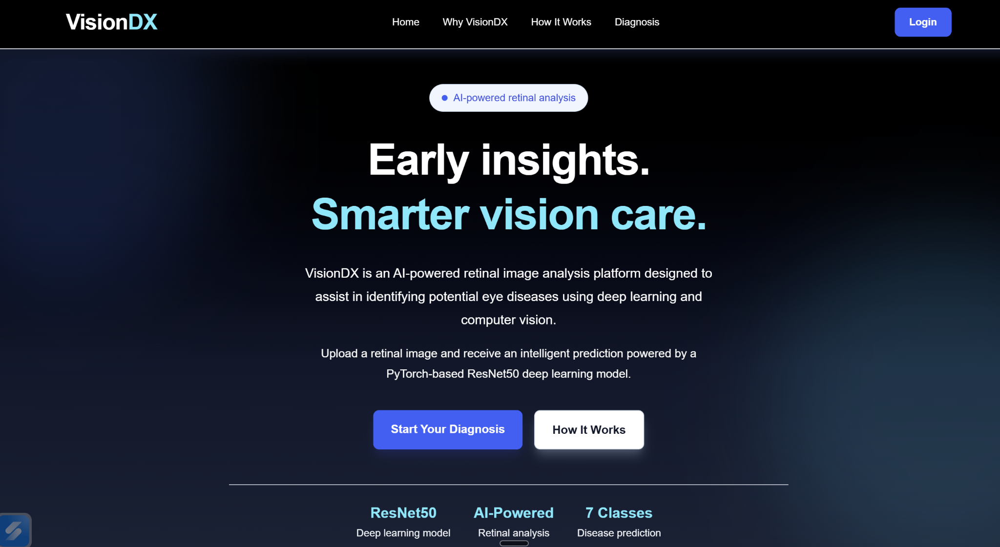
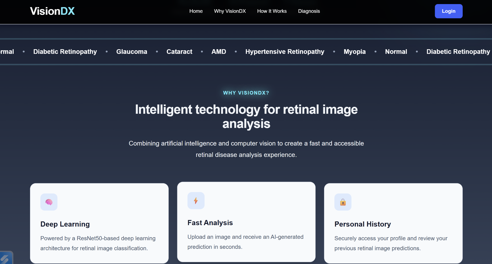
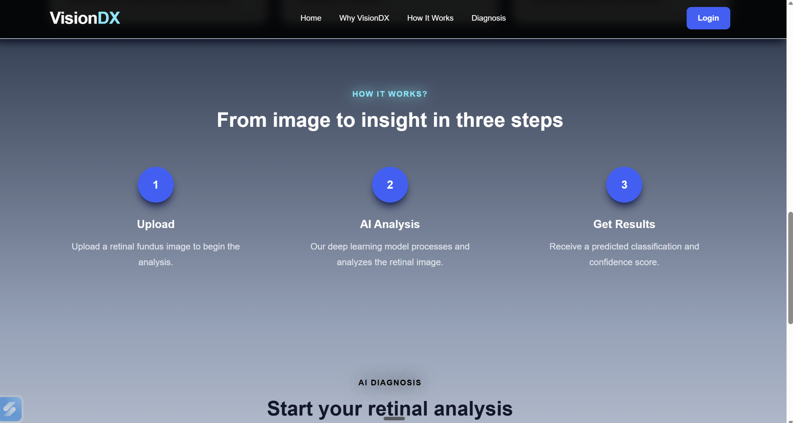
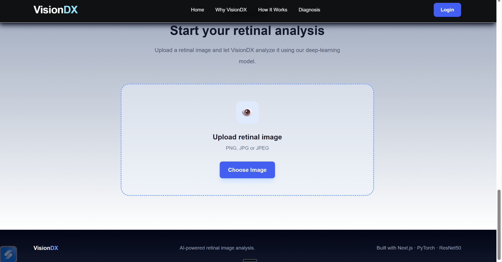

# VisionDX — Multi-Disease Retinal Diagnosis

<p align="center">
  <b>AI-powered retinal image analysis using Deep Learning and Computer Vision</b>
</p>

## Overview

VisionDX is a full-stack deep learning application for analyzing retinal fundus images and predicting potential retinal conditions.

The project combines a **PyTorch-based ResNet-50 model**, **FastAPI backend**, and **React + Vite frontend** to provide an interactive retinal image analysis platform.

> **Note:** VisionDX is an educational/research prototype and is not intended to replace professional medical diagnosis.

## Key Features

- 🧠 ResNet-50 based deep learning model
- 👁️ Multi-class retinal image classification
- 📤 Retinal fundus image upload
- ⚡ FastAPI inference backend
- 💻 React + Vite frontend
- 📊 Prediction confidence scores
- 🔄 Model training and evaluation pipeline
- 🖥️ CPU/CUDA support through PyTorch

## 📸 Application Screenshots

### 🏠 Home Page

<p align="center">
  
</p>

VisionDX provides an AI-powered interface for retinal image analysis.

---

### 🧠 Why VisionDX

<p align="center">
  
</p>

The platform combines deep learning and computer vision for retinal image analysis.

---

### ⚙️ How It Works

<p align="center">
  
</p>

The workflow consists of three main stages:

**Upload → AI Analysis → Get Results**

---

### 🔍 Retinal Diagnosis

<p align="center">
  
</p>

Users can upload PNG, JPG, or JPEG retinal fundus images and receive an AI-generated prediction.

## 🏗️ System Architecture

```text
React + Vite Frontend
        │
        │ HTTP POST /predict
        ▼
FastAPI Backend
        │
        │ Image Preprocessing
        ▼
PyTorch ResNet-50
        │
        ▼
Prediction + Confidence Scores
